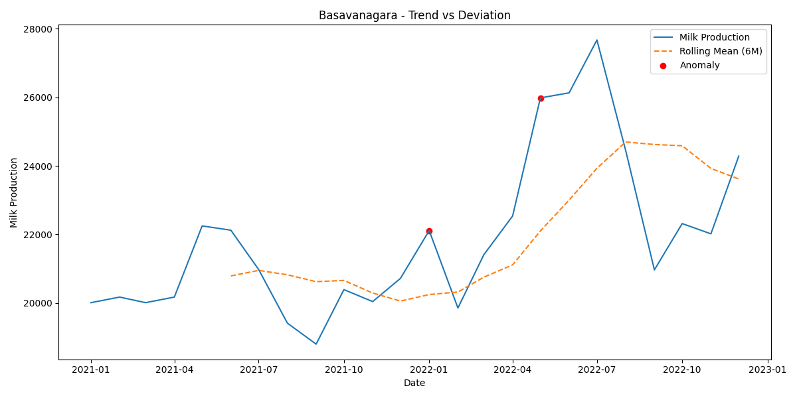

# 🥛 Milk Production Dashboard - Anomaly Detection & Business Insights

This project is a full-scale, interactive Streamlit dashboard designed to monitor monthly milk production across **20 dairy societies**. It integrates **time series forecasting**, **anomaly detection**, **profit/loss estimation**, and **society performance ranking** — enabling actionable business intelligence for dairy operations and supply chain stakeholders.

---

## 🚀 Live Demo

👉 [Click here to access the live Streamlit app](https://milk-production-dashboard.streamlit.app/)

---

## 📈 Problem Statement

Monitoring milk production consistency and forecasting future trends is critical in the dairy supply chain. Fluctuations in production can lead to:

- Missed demand and delivery inefficiencies
- Overstocking or understocking
- Financial loss from spoilage or unmet demand

This dashboard aims to:

- Detect anomalies in milk production per society
- Estimate potential revenue loss/gain
- Rank societies based on their trend adherence
- Enable proactive interventions and decisions

---

## 💡 Key Features

| Feature | Description |
|--------|-------------|
| 📊 **Interactive Dashboard** | Built with Streamlit to explore anomalies, ranks, and trends |
| 🔍 **Anomaly Detection** | Residual-based method to detect unexpected spikes/drops |
| 📈 **Forecasting** | Prophet-based forecasting of milk supply by society |
| 💰 **Profit/Loss Estimation** | Estimates revenue implications from anomalies |
| 🏅 **Society Ranking** | Ranks societies based on trend adherence & performance |
| 🖼️ **Visual Insights** | Auto-generated plots for anomaly visualization per society |

---

## 📦 Repository Structure

---

## 🧠 Business Impact

- Detect underperforming societies early
- Allocate logistics & storage based on trend patterns
- Reduce revenue loss by timely interventions
- Build scalable strategy for 100+ societies

---

## 📊 Sample Visualization

Each society plot shows:
- 📈 Forecasted trend
- ⚠️ Anomalies (spikes/dips)
- ✅ Normal zones
- 💸 Estimated financial gain/loss

---

## 🛠️ Tech Stack

- **Python 3.10**
- [Streamlit](https://streamlit.io)
- [Prophet](https://facebook.github.io/prophet/)
- Pandas, NumPy, Matplotlib, Seaborn
- Scikit-learn

